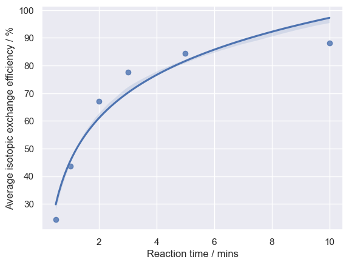

# Project-Python-Radiochemistry
# ☢️ Decay-corrected Radiochemical Yield Analysis

> Automated calculation and visualisation of decay-corrected radiochemical yield (RCY d.c.) from experimental data

---

## 🚀 What This Project Does

Transforms raw radiochemistry experiment data into **usable insights** by:

* Calculating time-corrected activity
* Computing RCY d.c.
* Automating batch processing across multiple experiments
* Visualising RCY d.c. across multiple experiments under different experimental parameters

---

## ⚡ Key Highlights

* 🔬 Built using **real first-hand radiochemistry data**
* ⚙️ Automated multi-file processing pipeline
* 📊 Clean, reproducible data analysis workflow
* 📈 Insightful visualisations using Seaborn

---

## 🧠 Skills Demonstrated

**Data Analysis**

* Pandas, NumPy
* Feature engineering (derived scientific metrics)

**Scientific Computing**

* Radioactive decay correction
* Experimental data interpretation

**Software Development**

* Modular Python scripting
* Workflow automation
* Reproducible notebook design

**Visualisation**

* Seaborn & Matplotlib
* Distribution and trend analysis

---

## 🧩 Core Components

### 1. Data Processing Jupyter Notebook (file_1)

* Inputs a CSV containing experimental data `240911_C24_Exp21.csv`
* Adds calculated time-corrected activity column `1a.jpg`
* Calculates RCY d.c. `1b.jpg`
* Outputs CSV containing the time-corrected activity column `240911_C24_Exp21_calculated`

<details>

```python
%pip install numpy
%pip install matplotlib
%pip install seaborn
%pip install pandas

import numpy as np
import matplotlib.pyplot as plt
import seaborn as sns
import pandas as pd

sns.set()
```


```python
exp21 = pd.read_csv("D:\\ProtonDrive\\My files\\Work\\Data Analysis\\Projects\\Python\\Radiochemistry\\Data\\240911_C24_Exp21.csv")
```


```python
exp21.dtypes
exp21.info
```


```python
F18_decay = 109.77
exp21["Time_corrected_activity, MBq"] = (
    exp21["Recorded activity, MBq"] *
    (2 ** (exp21["Time correction, Min"] / F18_decay))
)
exp21.info
```


    <bound method DataFrame.info of               Step  Recorded activity, MBq  Time correction, Min  \
    0     QMA retained                   24.60                     0   
    1       RV not dry                 1298.00                     0   
    2           RV dry                 1096.00                    27   
    3         Small RV                  290.00                    40   
    4   Small RV empty                    3.73                    60   
    5     tc18 trapped                   35.25                    66   
    6     Non-retained                  203.00                    67   
    7   tc18 retrapped                  202.30                    89   
    8     Non-retained                   20.74                    90   
    9    tc18 retained                   21.49                    95   
    10         Product                  154.72                    97   
    
        Time_corrected_activity, MBq  
    0                      24.600000  
    1                    1298.000000  
    2                    1299.734222  
    3                     373.329933  
    4                       5.448175  
    5                      53.475588  
    6                     309.909474  
    7                     354.868006  
    8                      36.611885  
    9                      39.152690  
    10                    285.467310  >


```python
exp21.to_csv("240911_C24_Exp21_calculated.csv", index=False)
```


```python
start = exp21.loc[3, "Time_corrected_activity, MBq"]
end = exp21.loc[10, "Time_corrected_activity, MBq"]

RCY_dc = (end / start) * 100
rounded_RCY_dc = round(RCY_dc, 1)
print(rounded_RCY_dc)
```

    76.5

</details>

### 2. Visualisation Jupyter Notebook (file_2)

* Analyses RCY d.c. distributions from CSV `241210_C24_Reaction_time_0.5.csv`
* Calculates an average RCY d.c. across multiple experiments `241210_C24_Reaction_time_0.5_calculated.csv`
* Generates publication-style plots `output.png`

<details>

```python
%pip install numpy
%pip install matplotlib
%pip install seaborn
%pip install pandas

import numpy as np
import matplotlib.pyplot as plt
import seaborn as sns
import pandas as pd

sns.set()
```


```python
Reaction_time_05mg = pd.read_csv("D:\\ProtonDrive\My files\\Work\\Data Analysis\\Projects\\Python\\Radiochemistry\\Data\\241210_C24_Reaction_time_0.5.csv")
```


```python
Reaction_time_05mg.info()
print(Reaction_time_05mg)
```


```python
Reaction_time_05mg["Average isotopic exchange efficiency / %"] = (
    Reaction_time_05mg.filter(like="Isotopic exchange efficiency").mean(axis=1)
)
print(Reaction_time_05mg.head())
```

       Reaction time / mins  Isotopic exchange efficiency reaction 1 / %  \
    0                   0.5                                         29.3   
    1                   1.0                                         53.1   
    2                   2.0                                         77.1   
    3                   3.0                                         84.2   
    4                   5.0                                         88.7   
    
       Isotopic exchange efficiency reaction 2 / %  \
    0                                         17.0   
    1                                         30.1   
    2                                         53.7   
    3                                         68.7   
    4                                         79.8   
    
       Isotopic exchange efficiency reaction 3 / %  \
    0                                         26.5   
    1                                         48.0   
    2                                         70.4   
    3                                         79.9   
    4                                         84.9   
    
       Average isotopic exchange efficiency / %  
    0                                 24.266667  
    1                                 43.733333  
    2                                 67.066667  
    3                                 77.600000  
    4                                 84.466667  
    


```python
Reaction_time_05mg.to_csv("Data/241210_C24_Reaction_time_0.5_calculated.csv", index=False)
```


```python
sns.regplot(data=Reaction_time_05mg,
            x="Reaction time / mins", 
            y="Average isotopic exchange efficiency / %", 
            scatter=True,
            ci=20,
            logx=True    
            )
```


</details>

### 3. Automation Python Script (file_3)

* Processes multiple CSV files e.g. `240911_C24_Exp22.csv`
* Produces CSV files containing the calculated column e.g. `240911_C24_Exp22_calculated.csv`
* v2 was developed to produce a consolidated RCY d.c. dataset in the form of a summary CSV `RCY_summary.csv`

```
├──project/
├──RCY_dc_script_v2.py
├──input/ 
	├── raw_csv_files 
├──output/ 
	├── calculated_csv_files 
	├── rcy_summary.csv
```

<details>

````python 
import os
import pandas as pd

INPUT_FOLDER = "input"
OUTPUT_FOLDER = "output"
F18_DECAY = 109.77

os.makedirs(OUTPUT_FOLDER, exist_ok=True)

def process_file(file_path):
    df = pd.read_csv(file_path)

    df["Time_corrected_activity, MBq"] = (
        df["Recorded activity, MBq"] *
        (2 ** (df["Time correction, Min"] / F18_DECAY))
    )

    start = df.loc[3, "Time_corrected_activity, MBq"]
    end = df.loc[10, "Time_corrected_activity, MBq"]

    rcy = (end / start) * 100
    return df, round(rcy, 1)


def main():
    results = []

    for filename in os.listdir(INPUT_FOLDER):
        if filename.endswith(".csv"):
            input_path = os.path.join(INPUT_FOLDER, filename)

            try:
                df, result = process_file(input_path)

                # Save processed CSV
                output_filename = filename.replace(".csv", "_calculated.csv")
                df.to_csv(os.path.join(OUTPUT_FOLDER, output_filename), index=False)

                # Store result
                results.append({
                    "file": filename,
                    "RCY_%": result
                })

                print(f"{filename} → RCY: {result}%")

            except Exception as e:
                print(f"Error processing {filename}: {e}")

    # Save summary CSV
    summary_path = os.path.join(OUTPUT_FOLDER, "RCY_summary.csv")
    pd.DataFrame(results).to_csv(summary_path, index=False)


if __name__ == "__main__":
    main()
````

</details>

---

## 💡 Why This Project Matters

Radiochemistry workflows are **time-sensitive and data-heavy**.
This project:

* Reduces time spent calculating
* Reduces manual calculation errors
* Improves reproducibility
* Enables faster experimental insight

---

## 🛠️ Tools & Technologies

* Python
* Pandas / NumPy
* Seaborn / Matplotlib
* Jupyter Notebooks
* Visual Studio Code

---

## 📌 Takeaway

A practical example of turning **raw scientific data → automated pipeline → actionable insight** using Python.

---

## 📂 Files in This Repository

| File / Folder | Description |
|--------------|------------|
| `file_1` | Data Processing Jupyter Notebook + Data + Screenshots |
| `file_2` | Visualisation Jupyter Notebook + Data + Screenshots |
| `file_3` | Automation Python Script v1 + v2 + Data + Screenshots |
| `README.md` | Project documentation |

---

## 🔗 Connect With Me
[](https://www.linkedin.com/in/cameron-newbould-4a434a308/)
